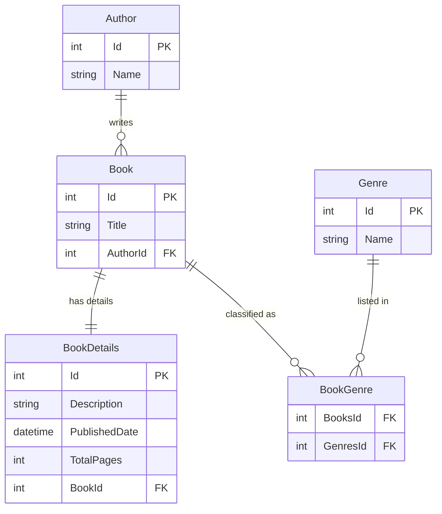

# SimpleBookWebApi
SimpleBookWebApi is a .NET 9 controller-based Web API for a book library system that manages books, authors, genres and book details using PostgreSQL. The system allows users to perform CRUD operations on books and manage their relationships with authors and genres. Authentication and role-based authorization are implemented using JWT tokens.

  
  
  
  
  
  
  

## Features
- **User Management:** Register, login and maintain user sessions with JWT and refresh tokens.
- **Role-based Access Control:** Admins can manage books, while regular users can view books.
- **Book Management:** Perform CRUD operations on books in the book library system using .NET 9 Web API, EF Core, and PostgreSQL.
- **Book Details:** Each book has a 1-to-1 relationship with detailed information, including description, published date, and total pages.
- **Authors:** Assign books to authors (1-to-many relationship) to manage author-book associations.
- **Genres:** Books can have multiple genres and genres can belong to multiple books (many-to-many relationship) using EF Core navigation properties.
- **Scalar API Docs:** Interactive API documentation and testing using Scalar, providing a modern developer experience for exploring endpoints and testing the API.

## Technologies Used
- **.NET 9 / ASP.NET Core Web API:** Framework for building the web application.
- **PostgreSQL (via Npgsql):** Database to store book-related data.
- **Entity Framework Core:** ORM for database management.
- **Scalar:** Interactive API documentation & testing.

## Authentication & Authorization
- **JWT Authentication:** Users can register and log in using a username and password. After login, a JWT access token and refresh token are issued.
- **Roles:** Users can access the API after logging in, but only Admins can perform sensitive operations like adding, updating, or deleting books.
- **Refresh Tokens:** Long-lived refresh tokens allow the client to get new access tokens without logging in again.
- **Protected Endpoints:** 
  - Regular users can fetch books and view details.
  - Admin users can create, update, and delete books.

## Database Structure & Relationships
- **Book & BookDetails (One-to-One):** Each book has one book detail.
- **Book & Author (One-to-Many):** Each book may have one author but author can have multiple books.
- **Book & Genre (Many-to-Many):** A book can have multiple genres and a genre can belong to multiple books.

## ER Diagram

 
Note: The ApplicationUser table is used for authentication and role-based authorization. It is not part of the main book library data model.

